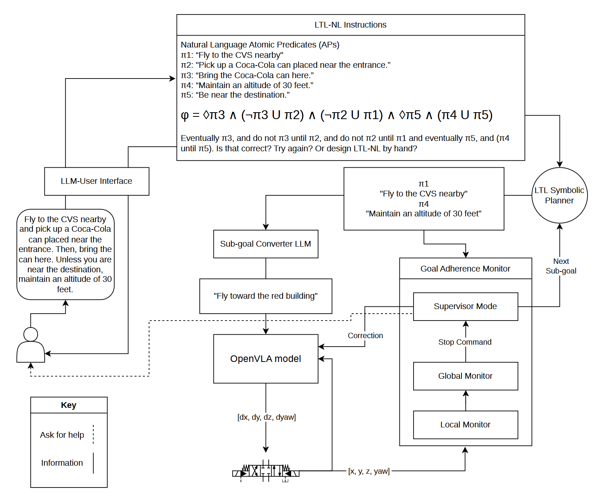

# Closing the Language-Level Loop: LTL Planning with Online Goal Adherence Monitoring for UAV Navigation

<p align="center">
  <strong>Arthur De Los Santos</strong>&nbsp;&nbsp;&nbsp;
  <strong>Makram Chahine</strong>&nbsp;&nbsp;&nbsp;
  <strong>Wei Xiao</strong>&nbsp;&nbsp;&nbsp;
  <strong>Daniela Rus</strong>
</p>

<p align="center">
  MIT CSAIL, Distributed Robotics Lab&nbsp;&nbsp;|&nbsp;&nbsp;Worcester Polytechnic Institute
</p>

<p align="center">
  <a href="https://github.com/arthurdls/robust-vision-language-navigation"></a>&nbsp;&nbsp;
  
</p>

---

<p align="center">
  
</p>

<p align="center"><em>
<b>RVLN</b> compiles free-form instructions into an LTL-NL automaton (left), executes each sub-goal with a frozen OpenVLA controller (center), and supervises progress with a VLM-based GoalAdherenceMonitor that maintains a running text diary over local and global image grids (right). On premature convergence, the supervisor issues corrective imperatives back to the VLA.
</em></p>

## Abstract

Vision-Language-Action (VLA) policies have enabled language-conditioned control for UAVs, but they fail on long-horizon missions: they drift from multi-step instructions, hallucinate sub-goal completion before visual evidence supports it, and offer no introspective signal for detecting or correcting failures. We introduce **RVLN**, a hierarchical neuro-symbolic system that surrounds a frozen VLA controller with two complementary language-driven supervisors. An automatic NL-to-LTL-NL compiler translates free-form instructions into a Spot-compiled monitor automaton with human-readable predicates, while a **GoalAdherenceMonitor** periodically queries a VLM over local and global image grids, maintaining a running natural-language diary as structured short-term memory for completion assessment and corrective re-prompting. We evaluate on a 6-sub-goal urban UAV mission across seven ablation conditions, achieving **83% sub-goal success** versus 0--50% for all baselines.

## Key Results

**Preliminary** single-run results on a six-sub-goal urban UAV mission in UnrealZoo Downtown West (n=1 per condition). Full evaluation covers 3 maps, 5 tasks per map, 3 starting position variants = 315 total episodes across 7 conditions.

| | Condition | Success Rate | Steps | VLM Calls | Corrections | Time (s) |
|:---:|-----------|:---:|:---:|:---:|:---:|:---:|
| C0 | **Full System (RVLN)** | **5/6 (83%)** | 760 | 96 | 15 | 899 |
| C1 | Naive VLA | 0/6 (0%) | 72 | 0 | 0 | 74 |
| C2 | LLM Planner | 3/6 (50%) | 879 | 104 | 13 | 1126 |
| C3 | Open-Loop LTL | 0/6 (0%) | 275 | 0 | 0 | 272 |
| C4 | Single Frame | 2/6 (33%) | 1620 | 101 | 24 | 1741 |
| C5 | Grid Only | 1/6 (17%) | 321 | 12 | 0 | 386 |
| C6 | Text Only | 0/6 (0%) | 735 | 87 | 13 | 868 |

**Key findings:**
- Task decomposition is strictly necessary: the naive VLA (C1) fails immediately.
- Runtime monitoring is strictly necessary: open-loop LTL (C3) achieves 0% despite correct decomposition, converging prematurely on every sub-goal.
- The LTL formalism outperforms LLM-only planning (C0: 83% vs C2: 50%).
- Both text diary and image grids are independently necessary: removing either degrades performance to 0-17%.

**Experimental design notes:**
- Task category distribution is uneven across maps (Greek Island is ~80% constrained, Suburb Neighborhood is ~80% sequential). Per-category breakdowns should be interpreted alongside per-map results.
- C1 and C3 require manual video review for task success and constraint adherence metrics.
- Simulator stochasticity (propeller visual effects, rendering variations) cannot be fully controlled.
- 45 episodes per condition provides borderline statistical power for moderate effect sizes.

## Contributions

1. **RVLN**: a neuro-symbolic system for long-horizon UAV navigation combining automatic LTL-NL compilation with online VLM-based goal-adherence monitoring over a frozen VLA controller.
2. **GoalAdherenceMonitor**: a zero-shot, prompt-only runtime supervisor that maintains a natural-language diary across checkpoints, enabling temporal reasoning about sub-goal progress without fine-tuning or failure datasets.
3. **Seven-condition ablation study** demonstrating that every component (LTL decomposition, text diary, image grids, temporal context) contributes measurably.
4. **Full codebase release** including the LTL planner, goal adherence monitor, and hardware interface for a custom quadcopter.

## Method Overview

RVLN operates as a five-stage pipeline at two timescales:

1. **NL-to-LTL-NL Compilation**: A few-shot LLM call lifts free-form English into an LTL-NL formula with human-readable predicates, compiled into a deterministic monitor automaton via [Spot](https://spot.lre.epita.fr/).

2. **SubgoalConverter**: Each LTL-NL sub-goal is translated into a clean OpenVLA imperative by stripping visual stopping conditions (e.g., "turn right *until you see the red car*" becomes "turn right"). The GoalAdherenceMonitor enforces the original stopping condition externally.

3. **OpenVLA Execution**: The frozen 7B-parameter VLA controller generates actions from egocentric RGB frames and the converted imperative.

4. **GoalAdherenceMonitor**: At each checkpoint, two VLM queries run:
   - *Local query*: a two-frame grid (previous + current) for change detection.
   - *Global query*: a nine-frame grid across the trajectory, combined with the running text diary and displacement vector, for completion assessment.
   - *Obstacle awareness*: the monitor proactively stops the drone when a collision with any physical obstruction appears imminent, then issues corrective commands to ascend above, route around, or retreat from the obstacle.

5. **Supervisor Mode**: On convergence or forced convergence, the VLM evaluates completion. If incomplete, a single-action corrective imperative is issued back to the VLA. Stall detection escalates to the operator when progress plateaus.

```
Instruction: "Go to the red building, then land near the tree, never fly over the highway"
    |
    v
LTL Planner (LLM -> Spot automaton -> constraint classification)
    |
    v  subgoal: "approach the red building"
    |  constraints: [AVOID: "Flying over the highway"]
SubgoalConverter (LLM -> short OpenVLA command)
    |
    v  command: "fly toward building"
OpenVLA Server (VLA model, returns drone actions)
    |
    v  action: [dx, dy, dz, dyaw]
Unreal Sim / MiniNav Hardware
    ^                       |
    |  periodic frames      |  convergence (drone stops)
    v                       v
GoalAdherenceMonitor -----> Supervisor Mode
  |  checkpoint every       |  evaluate: complete / stopped short / overshot
  |  N steps or N seconds   |  issue corrective command to OpenVLA
  |                         |  if budget exhausted -> ask_help
  |  stall detection:       |
  |  completion plateau     |
  |  -> operator escalation |
```

## Getting Started

### Prerequisites

- **CUDA GPU** for the OpenVLA server (tested with A100 / RTX 4090)
- **conda** (Miniconda or Anaconda)
- **~20 GB disk** for model weights + Unreal environment
- **API keys** for OpenAI and/or Google (LLM / VLM calls)

### Installation

```bash
# Clone
git clone git@github.com:arthurdls/robust-vision-language-navigation.git
cd robust-vision-language-navigation

# Create both conda envs and scaffold .env.local
bash tools/setup.sh

# Install the rvln package in each env
conda activate rvln-sim    && pip install -e .
conda activate rvln-server && pip install -e ".[server]"

# Configure API keys
$EDITOR .env.local          # OPENAI_API_KEY, GOOGLE_API_KEY

# Download assets (~20 GB)
conda activate rvln-sim
python tools/download_weights.py       # -> weights/OpenVLA-UAV/
python tools/download_simulator.py     # -> runtime/unreal/
```

### Running

```bash
# Terminal 1: Start the OpenVLA server (GPU required)
conda activate rvln-server
python scripts/start_server.py

# Terminal 2: Run the full pipeline
conda activate rvln-sim
python scripts/run_integration.py --task first_task.json
```

Most commands are also wrapped in the `Makefile` (`make setup`, `make download-weights`, `make server`, `make run`).

### Reproducing the Full Evaluation

The evaluation runs 7 conditions across 3 maps (45 tasks per condition = 315 total episodes). The orchestrator manages the simulator lifecycle automatically, starting and stopping it for each map.

**Single machine (simulator + orchestrator on the same host):**

```bash
# Terminal 1: OpenVLA server (GPU required)
conda activate rvln-server
python scripts/start_server.py

# Terminal 2: Run all conditions on all maps
conda activate rvln-sim
python scripts/run_all_conditions.py
```

To run a subset:

```bash
# One map, all conditions
python scripts/run_all_conditions.py --map greek_island

# All maps, specific conditions
python scripts/run_all_conditions.py --conditions 0,2,3

# One map, specific conditions
python scripts/run_all_conditions.py --map downtown_west --conditions 0,1,3
```

**Two machines (orchestrator on one, simulator on another):**

```bash
# On the simulator machine (has the GPU + Unreal binaries):
conda activate rvln-sim
python scripts/run_sim_controller.py --port 9002

# On the orchestrator machine:
conda activate rvln-sim
python scripts/run_all_conditions.py \
  --sim-controller <SIM_HOST>:9002 \
  --sim_host <SIM_HOST> \
  --sim_api_port 9001
```

The sim controller will print the exact orchestrator command with the correct IP when it starts.

Results are written to `results/condition<N>/<map_dir>/`. Completed tasks are tracked via `run_info.json`, so interrupted runs can be resumed by re-running the same command (already-completed tasks are skipped, aborted/crashed tasks are retried).

## Repository Structure

```
robust-vision-language-navigation/
  src/rvln/                 Core Python package
    ai/                     LTL planner, GoalAdherenceMonitor, SubgoalConverter, LLM providers
    sim/                    Unreal sim environment setup, pose utilities
    eval/                   Batch evaluation runner, metrics, playback
    server/                 OpenVLA inference server
    mininav/                MiniNav real-drone interface (TCP control + camera + odometry)
  src/gym_unrealcv/         UnrealCV gym environments (vendored from UAV-Flow)
  scripts/                  CLI entry points
    run_all_conditions.py   Orchestrator: runs conditions across maps
    run_sim_controller.py   Remote simulator lifecycle daemon
    run_integration.py      Full system (C0)
    run_condition{2-6}_*.py Ablation conditions
    run_simulator.py        Launches Unreal binary + sim API server
    start_server.py         OpenVLA server
    run_hardware.py         Real-drone pipeline
    run_repl.py             Interactive drone REPL
    playback.py             FPV viewer and MP4 encoder
  tasks/                    Task JSON definitions
  tools/                    Setup, weight/simulator download scripts
  tests/                    Test suite
```

## Hardware Deployment (MiniNav)

The same pipeline runs on real drones via the MiniNav interface. The drone-facing module streams commands `[frame_count, vx, vy, vz, yaw]` as `float32` over TCP.

```bash
# Dry run against simulated hardware
python scripts/start_mock_hardware.py --host 127.0.0.1 --port 8080 --frame_port 8081

# Live flight
python scripts/run_hardware.py \
  --preferred_server_host 192.168.0.101 \
  --control_port 8080 \
  --camera 0 \
  --initial_position 0,0,0,0 \
  --odom_udp_port 9001 \
  --command_is_velocity
```

The hardware interface supports interactive operator help (new instruction, replan, skip, abort), time-based asynchronous diary checkpoints, and external odometry via HTTP or UDP.

## Citation

If you find this work useful, please cite:

```bibtex
@article{delossantos2026rvln,
  title={Closing the Language-Level Loop: {LTL} Planning with Online Goal Adherence
         Monitoring for {UAV} Navigation},
  author={De Los Santos, Arthur and Chahine, Makram and Xiao, Wei and Rus, Daniela},
  year={2026}
}
```

## Acknowledgments

This work was supported by the MIT Generative AI Impact Consortium (MGAIC), administered through the Distributed Robotics Lab at MIT CSAIL.

## License

`src/gym_unrealcv/`, `src/rvln/eval/`, and `src/rvln/server/` contain code vendored from [UAV-Flow](https://github.com/buaa-colalab/UAV-Flow) (commit `0114801`). Upstream licensing applies to those subtrees; see the original repository for attribution requirements.

## Ethical Use Disclaimer

This research was developed for civilian scientific purposes: advancing autonomous UAV navigation through language grounding and formal verification. The authors do not endorse or support the use of this work, in whole or in part, for military operations, weapons development, surveillance of civilian populations, or any application intended to cause harm to human life.

We encourage all users and developers who build upon this work to consider the ethical implications of their applications and to prioritize human safety and well-being.
